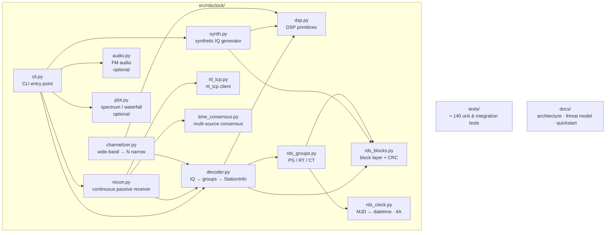
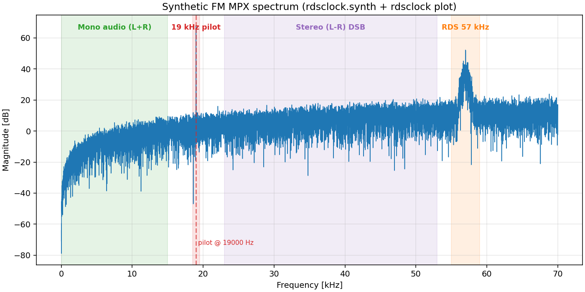
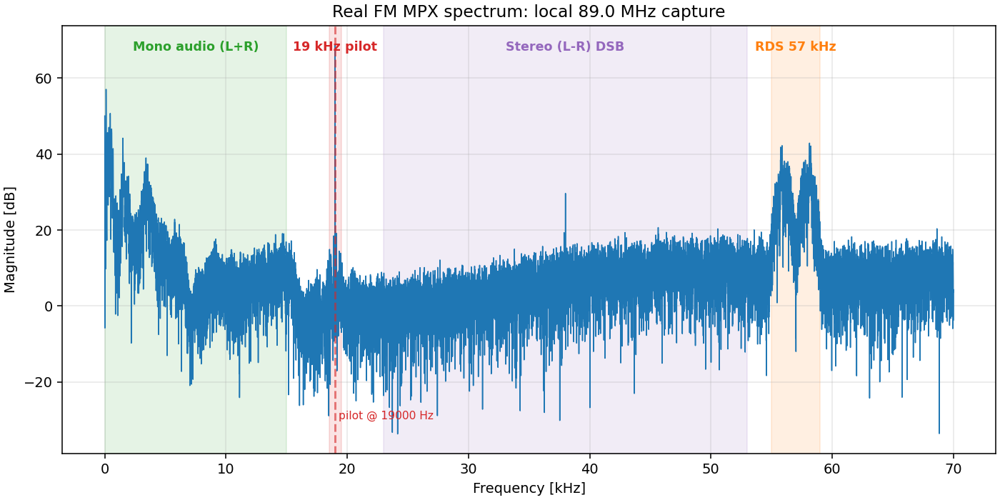

# rdsclock — Passive RDS Clock-Time Receiver

[](LICENSE)
[](pyproject.toml)
[](https://github.com/mateusz-klatt/rdsclock/actions/workflows/test.yml)
[](https://sonarcloud.io/summary/new_code?id=mateusz-klatt_rdsclock)
[](https://sonarcloud.io/component_measures?id=mateusz-klatt_rdsclock&metric=coverage)

A pure-Python passive receiver for the RDS (Radio Data System) Clock-Time
data stream broadcast by FM radio stations. Built for **GPS-denied,
NTP-unavailable** scenarios where an operator needs a non-GPS source of
UTC and cannot emit RF.

The package is composed of small, audit-friendly modules: DSP primitives,
the RDS block / group layers, a synthetic-signal generator, a multi-source
time-consensus engine, and a continuous "recon" mode that hops across
multiple FM stations and aggregates their clocks into a single, robust
time estimate with an explicit uncertainty.

## Quick Start

```bash
make setup            # creates .venv and installs the package (editable)
make test             # runs the unit and integration test suite
make demo             # synthetic 3-station multi-channel showcase (no SDR)
make recon-offline    # replay recon over eter/ recordings
make recon            # passive recon LIVE with an RTL-SDR
```

All sub-commands are also available through the CLI:

```bash
rdsclock generate build/test.iq --time 2026-05-17T12:00 --snr 25
rdsclock decode build/test.iq -v
rdsclock live --freq 95.5 --duration 10
rdsclock multi --freqs 92.0,98.3,106.8 --mode auto
rdsclock recon --start 87.5 --end 108.0 --max-stations 5
rdsclock scan --start 87.5 --end 108 --step 0.1
rdsclock play --freq 102.4                       # live FM audio (needs [audio] extra)
rdsclock play --file build/capture.iq --fs 250000
rdsclock plot build/capture.iq --out spec.png    # MPX spectrum (needs [plot] extra)
rdsclock plot wide.iq --kind waterfall --fs 2400000
```

Optional dependency groups (install with `pip install 'rdsclock[audio]'` etc.):

| Extra    | Brings in     | Enables                       |
|----------|---------------|-------------------------------|
| `audio`  | `sounddevice` | live FM audio playback        |
| `plot`   | `matplotlib`  | MPX spectrum and waterfall PNGs |
| `dev`    | pytest, ruff  | running the test/lint suite   |

## Architecture



The tree itself lives under `src/rdsclock/`; see
[`docs/ARCHITECTURE.md`](docs/ARCHITECTURE.md) for the data-flow
description of each module.

## What FM MPX Looks Like

| Synthetic capture | Real local capture |
|-------------------|--------------------|
|  |  |
| Generated by `rdsclock.synth.synthesize_fm_iq` (no broadcast content). | Spectrum derived from a local FM capture. The plot is a derivative work; the source IQ is not redistributed. |

The two plots show the FM-demodulated baseband: on the left an entirely
synthetic stream produced by the package, on the right a real-world
capture analysed by the same `rdsclock plot` renderer. The annotated
bands are the four standard FM-MPX components:

| Band            | Component                                |
|-----------------|------------------------------------------|
| 0 – 15 kHz      | Mono audio (L+R)                         |
| 19 kHz          | Stereo pilot tone                        |
| 23 – 53 kHz     | Stereo (L–R) double-sideband subcarrier  |
| 57 kHz (±~2 kHz)| RDS BPSK on the 3rd harmonic of the pilot |

The receiver locks the RDS subcarrier through the pilot
(`estimate_pilot_19khz × 3`), which is robust against the typical
RTL-SDR ppm drift. Reproduce either figure with:

```bash
# Synthetic
rdsclock generate build/test.iq --snr 30
rdsclock plot build/test.iq --out spectrum.png      # needs the [plot] extra

# From your own local capture (no broadcast content shared, plot only)
rdsclock live --freq 89.0 --duration 30 --save build/local.iq
rdsclock plot build/local.iq --out spectrum.png
```

## RDS Group 4A — Bit Layout (IEC 62106-2:2021, Figure 11)

The 34-bit Clock-Time payload (MJD 17 + Hour 5 + Minute 6 + LTO sign 1 +
LTO magnitude 5) is distributed across data words B, C and D
(MSB-first per word):

| Field      | Block B       | Block C        | Block D         |
|------------|---------------|----------------|-----------------|
| MJD        | `[1:0]` (MSB) | `[15:1]` (LSB) | —               |
| HOUR       | —             | `[0]` (MSB)    | `[15:12]` (LSB) |
| MINUTE     | —             | —              | `[11:6]`        |
| LTO sign   | —             | —              | `[5]`           |
| LTO mag    | —             | —              | `[4:0]`         |

The equivalent bit-extraction formula is:

```c
MJD    = ((B & 0x0003) << 15) | (C >> 1)
HOUR   = ((C & 0x1) << 4)     | (D >> 12)
MINUTE = (D >> 6) & 0x3F
SIGN   = (D >> 5) & 0x1
MAG    = D & 0x1F
```

The Modified Julian Day epoch is **1858-11-17 00:00 UT**. The
`hh:mm` field is UTC; local time = UTC + sign · magnitude · 30 min.

> The same bit layout is described in the free public
> [NRSC-4-B](https://nrscstandards.org/standards-and-guidelines/)
> standard, which is a superset of IEC 62106. See
> [`docs/REFERENCES.md`](docs/REFERENCES.md) for the full source list.

## Passive Time-Receiver Mode (`recon`)

`recon` implements a continuous, fully passive time receiver designed
for environments where:

- **GPS** may be jammed or spoofed,
- **NTP** is unavailable (no internet),
- the operator **cannot emit RF** of any kind,
- the broadcast language is **unknown** (so PS/RT are not used).

### Operating Principle

1. **Acquisition** — a quick band scan locates strong FM stations and
   tests each one for valid RDS Group 4A (Clock-Time).
2. **Maintenance** — the watchlist is hopped through, collecting one
   CT observation per station per cycle.
3. **Consensus** — the multi-source median of the observed times
   becomes the operator's UTC reference. Each station carries a
   **trust score** that decays when it diverges from the median
   (Hampel outlier rule).
4. **RF fingerprinting** — per-station features (CFO, RSSI, PI) are
   recorded for later analysis. Automated shift detection is on the
   roadmap.
5. **Holdover** — between Clock-Time messages the receiver
   extrapolates UTC from a local monotonic clock disciplined by an
   estimated ppm drift. Uncertainty grows linearly with the age of
   the most recent CT.
6. **Operator display** — `UTC 2026-05-17 04:23:18  ±2s  N=3  trust=HIGH`.

### Quick Run

```bash
# Live
rdsclock recon --start 87.5 --end 108 --max-stations 5 --rescan-min 10

# Offline (no SDR, replays recordings or any directory of .iq files)
rdsclock recon --from-dir eter/
```

See `docs/operator-quickstart.md` for an operator-oriented walkthrough
and `docs/THREAT_MODEL.md` for the security threat model.

## Hardware

- **RTL-SDR** USB dongle (tested: RTL2838 with R820T2 tuner).
- `rtl_tcp -a 127.0.0.1` (loopback only; do **not** expose to the
  network without a firewall — the protocol has no authentication).
- An FM-band (VHF II ~88–108 MHz) antenna.

## Testing

```bash
make test           # all tests, including real-recording validation
make test-fast      # skip 'slow' and 'real_sdr' tests
make coverage       # generate htmlcov/
```

The synthetic round-trip (`tests/test_decoder_synthetic.py`) is the
load-bearing correctness check: it generates IQ from a known clock,
runs the full pipeline, and asserts the decoded clock matches.

Real-world validation against a live RTL-SDR (`tests/test_real_recordings.py`)
is gated by the `real_sdr` marker and skips automatically when no
`rtl_tcp` daemon is reachable. These tests do not assume any specific
station or date — they verify pipeline invariants on whatever signal
the local antenna picks up.

## Status

- **0.2.2** — current release. Operator-facing polish: 250 kS/s SDR
  captures can now play at 48 kHz audio via rational resampling, and
  Programme Service names are displayed only after validation so
  dynamic-PS stations do not show mixed scrolling fragments. Decoder
  group counts and PI codes remain locked to the 0.2.1 baseline.
  Pre-1.0; the CLI and on-disk formats may still change.
- 240+ tests including a real-IQ regression backed by a 6 s capture
  of Polskie Radio Trójka 98.8 from Warsaw; line coverage **100 %**
  (tracked by SonarCloud).

## Legal Note

The receiver is passive — it never transmits and never emits RF, so
*receiving* broadcast FM is lawful in Poland and across the EU.
However, **the captured IQ data and any decoded audio should be kept
local**:

- Polish *Prawo komunikacji elektronicznej* (Dz.U. 2024 poz. 1221)
  preserves the confidentiality of electronic communications and
  restricts dissemination of received content.
- The audio embedded in an FM capture is generally a copyrighted work.

Local recording for technical or amateur-radio use is widely accepted;
public redistribution of those recordings typically requires
permission from the rights holders. The synthetic generator shipped
with the package produces copyright-free IQ files for tests and
demos. See [`docs/datasets.md`](docs/datasets.md) for details and
[`SECURITY.md`](SECURITY.md) for the security checklist. **None of
the above is legal advice.**

## Licence

[Apache License, Version 2.0](LICENSE).
