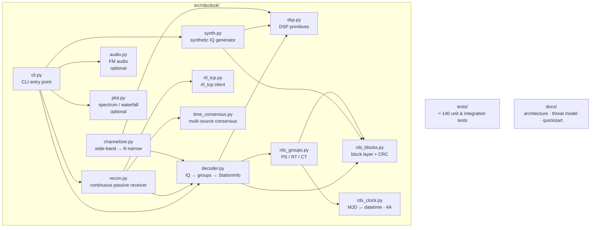

> 🇬🇧 English version: [`README.md`](README.md)

# rdsclock — pasywny odbiornik RDS Clock-Time

[](LICENSE)
[](pyproject.toml)
[](https://github.com/mateusz-klatt/rdsclock/actions/workflows/test.yml)
[](https://sonarcloud.io/summary/new_code?id=mateusz-klatt_rdsclock)
[](https://sonarcloud.io/component_measures?id=mateusz-klatt_rdsclock&metric=coverage)

Pasywny odbiornik strumienia Clock-Time systemu RDS (Radio Data System),
nadawanego przez stacje radiowe FM, napisany w czystym Pythonie. Pakiet
jest przeznaczony do scenariuszy, w których odbiorca potrzebuje źródła
UTC niezależnego od GPS i NTP oraz nie może emitować sygnału RF.

Pakiet składa się z małych modułów możliwych do audytu: podstawowych
bloków DSP, warstwy bloków i grup RDS, generatora sygnału syntetycznego,
silnika konsensusu czasu z wielu źródeł oraz ciągłego trybu `recon`,
który przełącza się między wieloma stacjami FM i agreguje ich zegary do
jednego odpornego oszacowania czasu z jawną niepewnością.

## Szybki start

Przepływ pracy pasywnego odbiornika czasu:

```bash
# 1. Uruchom rtl_tcp na hoście podłączonym do odbiornika
rtl_tcp -a 127.0.0.1 -p 1234

# 2. Skan pasma w poszukiwaniu stacji nadających RDS Clock-Time
#    (~17 min dla całego pasma FM przy 30 s na kanał — wystarcza,
#    by uchwycić większość rotacji PS).
rdsclock scan --start 87.5 --end 108.0 --step 0.1 --duration 30

# 3. Ciągły pasywny konsensus czasu z jawnej listy stacji nadających CT.
#    Tryb HOP — gdy stacje są rozsiane szerzej niż ~2 MHz (typowe dla
#    publicznych stacji FM w jednym mieście).
rdsclock recon --start 87.5 --end 108.0 --step 0.1 --dwell 60 --iterations 3

# 4. Tryb WIDE — trzy stacje dekodowane synchronicznie z jednej kapsuły.
#    Wymaga, by wszystkie częstotliwości mieściły się w fs (domyślnie
#    2.4 MS/s → ~2 MHz spread). W Warszawie pasują: Polskie Radio Jedynka
#    102.4 + Radio Kolor 103.0 + Rock Radio 103.7 (centrum 103.05 MHz,
#    spread 1.3 MHz — dwie stacje z CT plus jedna z RDS).
rdsclock multi --freqs 102.4,103.0,103.7 --mode wide --fs 2400000 \
  --duration 60 --save eter/wide-103.iq
# Każde 60 s nagrania 2.4 MS/s complex64 to ~2 GB pamięci RAM. Trzymaj
# krótki czas trwania jeśli host ma ograniczoną pamięć — do długotrwałych
# obserwacji służy tryb recon.

# 5. Tryb HOP — wielostacyjna baseline na rozproszonych częstotliwościach.
#    Lista najsilniejszych stacji warszawskich nadających CT:
rdsclock multi --freqs 91.0,94.0,96.5,98.3,98.8,102.4,103.7,107.5 \
  --mode hop --duration 60 --save eter/hop-warsaw.iq
```

> **Stacje warszawskie nadające RDS Clock-Time (zweryfikowane maj 2026):** 91.0 RMF FM,
> 94.0 Meloradio, 96.5 Radio Plus, 98.3 RMF Classic, 98.8 PR Trójka, 102.4 PR
> Jedynka, 103.7 Rock Radio, 107.5 Radio ZET. Inne stacje nadają RDS PS, ale
> nie nadają Group 4A (stacje komercyjne i religijne często pomijają CT).

API Pythona:

```python
from rdsclock.decoder import decode_file
from rdsclock.time_consensus import TimeConsensus

# Offline: zdekoduj zapisany plik IQ
result = decode_file("eter/baseline-20260518-035918/live-102.4MHz-300s.iq", fs=250_000)
print(f"PI {result.info.pi:#06x}  PS {result.info.ps_name!r}")
print(f"Zaobserwowane zegary: {len(result.info.clock_times)}")
for ct in result.info.clock_times:
    print(f"  {ct}  rx={ct.rx_monotonic_ns} ns")

# Konsensus sub-sekundowy (wymaga wielu stacji z wypełnionym rx_monotonic_ns)
tc = TimeConsensus()
# … podaj obserwacje z wielu stacji …
est = tc.sub_second_consensus()
if est is not None:
    print(f"Konsensus UTC: {est.utc} (±{est.precision_ms:.0f} ms z {est.station_count} stacji)")
```

Opcjonalne grupy zależności (instalacja przez `pip install 'rdsclock[audio]'` itd.):

| Extra    | Wprowadza     | Udostępnia                    |
|----------|---------------|-------------------------------|
| `audio`  | `sounddevice` | odtwarzanie audio FM na żywo  |
| `plot`   | `matplotlib`  | widmo MPX i wodospady do PNG  |
| `dev`    | pytest, ruff  | uruchamianie testów i lintów  |

## Architektura



Drzewo pakietu znajduje się w `src/rdsclock/`; opis przepływu danych
każdego modułu jest w [`docs/ARCHITECTURE.md`](docs/ARCHITECTURE.md).

## Jak wygląda FM MPX

| Rejestracja syntetyczna | Rzeczywista rejestracja lokalna |
|-------------------------|----------------------------------|
|  |  |
| Wygenerowane przez `rdsclock.synth.synthesize_fm_iq` bez treści nadawczej. | Widmo pochodzące z lokalnego przechwycenia FM. Wykres jest utworem zależnym; źródłowe IQ nie jest redystrybuowane. |

Dwa wykresy przedstawiają zdemodulowane pasmo podstawowe FM: po lewej całkowicie
syntetyczny strumień wytworzony przez pakiet, po prawej rzeczywiste
przechwycenie analizowane tym samym rendererem `rdsclock plot`.
Oznaczone pasma to cztery standardowe składowe FM-MPX:

| Pasmo           | Składowa                                 |
|-----------------|------------------------------------------|
| 0 – 15 kHz      | Audio mono (L+R)                         |
| 19 kHz          | Ton pilota stereo                        |
| 23 – 53 kHz     | Stereo (L–R), dwuwstęgowa podnośna       |
| 57 kHz (±~2 kHz)| RDS BPSK na 3. harmonicznej pilota       |

Odbiornik synchronizuje się z podnośną RDS przez pilota
(`estimate_pilot_19khz × 3`), co jest odporne na typowy dryft ppm
odbiorników RTL-SDR. Każdy z wykresów można odtworzyć poleceniami:

```bash
# Sygnał syntetyczny
rdsclock generate build/test.iq --snr 30
rdsclock plot build/test.iq --out spectrum.png      # wymaga rozszerzenia [plot]

# Z własnego nagrania lokalnego (bez udostępniania treści — sam wykres).
# Częstotliwość jest tylko przykładem — wybierz dowolną silną stację FM
# w swojej lokalizacji. Stacje publiczne na ogół częściej nadają RDS
# Clock-Time niż komercyjne / religijne.
rdsclock live --freq 102.4 --duration 30 --save build/local.iq
rdsclock plot build/local.iq --out spectrum.png
```

## Grupa RDS 4A — układ bitów (IEC 62106-2:2021, rysunek 11)

34-bitowe pole Clock-Time (MJD 17 + Hour 5 + Minute 6 + znak LTO 1 +
wartość LTO 5) jest rozłożone na słowa danych B, C i D
(od MSB w każdym słowie):

| Pole       | Blok B        | Blok C         | Blok D          |
|------------|---------------|----------------|-----------------|
| MJD        | `[1:0]` (MSB) | `[15:1]` (LSB) | —               |
| HOUR       | —             | `[0]` (MSB)    | `[15:12]` (LSB) |
| MINUTE     | —             | —              | `[11:6]`        |
| Znak LTO   | —             | —              | `[5]`           |
| Wartość LTO| —             | —              | `[4:0]`         |

Równoważny wzór ekstrakcji bitów:

```c
MJD    = ((B & 0x0003) << 15) | (C >> 1)
HOUR   = ((C & 0x1) << 4)     | (D >> 12)
MINUTE = (D >> 6) & 0x3F
SIGN   = (D >> 5) & 0x1
MAG    = D & 0x1F
```

Epoka zmodyfikowanej daty juliańskiej to **1858-11-17 00:00 UT**.
Pole `hh:mm` jest w UTC; czas lokalny = UTC + znak · wartość · 30 min.

> Ten sam układ bitów opisuje publicznie dostępny standard
> [NRSC-4-B](https://nrscstandards.org/standards-and-guidelines/),
> który jest nadzbiorem IEC 62106. Pełna lista źródeł znajduje się w
> [`docs/REFERENCES.md`](docs/REFERENCES.md).

## Tryb pasywnego odbiornika czasu (`recon`)

`recon` implementuje ciągły, w pełni pasywny odbiornik czasu dla
środowisk, w których:

- **GPS** może być zakłócony lub podatny na fałszowanie,
- **NTP** jest niedostępny, na przykład z powodu braku internetu,
- operator **nie może emitować RF** żadnego rodzaju,
- język emisji jest **nieznany**, więc pola PS/RT nie są używane.

### Zasada działania

1. **Akwizycja** — szybkie skanowanie pasma lokalizuje silne stacje FM
   i sprawdza każdą pod kątem poprawnej grupy RDS 4A (Clock-Time).
2. **Utrzymanie** — lista obserwacyjna jest obsługiwana skokowo, z
   pobraniem jednej obserwacji CT na stację w każdym cyklu.
3. **Konsensus** — wieloźródłowa mediana zaobserwowanych czasów staje
   się odniesieniem UTC operatora. Każda stacja ma **ocenę zaufania**,
   która maleje, gdy stacja odbiega od mediany (reguła odstających Hampela).
4. **Odcisk RF** — cechy dla każdej stacji, takie jak CFO, RSSI i PI, są
   zapisywane do późniejszej analizy. Automatyczne wykrywanie przesunięć
   pozostaje w planie prac.
5. **Znaczniki czasu odbioru** — przechwycenia na żywo wiążą odebranie
   zdekodowanej grupy 4A z monotonicznym zegarem hosta i korygują
   oszacowanie szybkości bitowej na podstawie tonu pilota 19 kHz. Przy
   sprawnym NTP jest to deklaracja UTC rzędu 30-80 ms; bez internetu
   demonstrację z co najmniej trzema stacjami należy traktować jako
   około 100-250 ms. Dokładność klasy sprzętowej wymaga sprzętowego
   źródła czasu.
6. **Holdover** — między komunikatami Clock-Time odbiornik ekstrapoluje
   UTC z lokalnego zegara monotonicznego dyscyplinowanego oszacowanym
   dryftem ppm. Niepewność rośnie liniowo z wiekiem najnowszego CT.
7. **Prezentacja operatorska** — `UTC 2026-05-17 04:23:18  ±2s  N=3  trust=HIGH`.

Zobacz `docs/operator-quickstart.md` dla instrukcji operatorskiej oraz
`docs/THREAT_MODEL.md` dla modelu zagrożeń bezpieczeństwa.

## Sprzęt

- Dongle USB **RTL-SDR** (testowany: RTL2838 z tunerem R820T2).
- `rtl_tcp -a 127.0.0.1` wyłącznie na pętli zwrotnej; **nie** wystawiaj
  usługi do sieci bez zapory, ponieważ protokół nie ma uwierzytelniania.
- Antena na pasmo FM (VHF II, około 88–108 MHz).

## Testowanie

```bash
make test           # all tests, including real-recording validation
make test-fast      # skip 'slow' and 'real_sdr' tests
make coverage       # generate htmlcov/
```

Syntetyczny przebieg pełnej pętli (`tests/test_decoder_synthetic.py`)
jest podstawowym sprawdzeniem poprawności: generuje IQ ze znanym
zegarem, uruchamia pełny pipeline i potwierdza zgodność zdekodowanego
czasu.

Walidacja rzeczywista z użyciem odbiornika RTL-SDR na żywo
(`tests/test_real_recordings.py`) jest oznaczona markerem `real_sdr`
i pomijana automatycznie, gdy demon `rtl_tcp` nie jest osiągalny. Testy
te nie zakładają konkretnej stacji ani daty; weryfikują inwarianty
potoku przetwarzania na sygnale odbieranym przez lokalną antenę.

## Status

- **1.0.0** — pierwsze wydanie stabilne. Publiczne API najwyższego
  poziomu jest zamrożone jako `from rdsclock import ...`; wewnętrzne
  funkcje pomocnicze modułów mogą nadal się zmieniać.
- Regresja na rzeczywistych plikach IQ oraz `tools/benchmark.py --check`
  tworzą bramkę regresyjną dla liczby grup, kodów PI i czasu dekodowania.
- Wielostacyjny konsensus subsekundowy jest dostępny przez
  `TimeConsensus.sub_second_consensus()`, gdy obserwacje zawierają
  znaczniki odbioru `rx_monotonic_ns`.
- Deklaracje dokładności są celowo ograniczone: wpis
  [0.4.0 w changelogu](CHANGELOG.md#040--2026-05-18) opisuje model
  znaczników odbioru i oczekiwane przedziały dokładności UTC.
- Ponad 240 testów, w tym pokrycie regresją na rzeczywistym IQ; pokrycie
  linii **100 %** (śledzone przez SonarCloud).

## Nota prawna

Odbiornik jest pasywny — nigdy nie nadaje i nie emituje RF, więc samo
*odbieranie* emisji FM jest zgodne z prawem w Polsce i w Unii
Europejskiej. Jednak **przechwycone dane IQ oraz zdekodowany dźwięk
powinny pozostawać lokalnie**:

- Polskie *Prawo komunikacji elektronicznej* (Dz.U. 2024 poz. 1221)
  chroni poufność komunikacji elektronicznej i ogranicza
  rozpowszechnianie odebranych treści.
- Dźwięk zawarty w przechwyceniu FM jest zwykle utworem chronionym
  prawem autorskim.

Lokalne nagrywanie do celów technicznych lub radioamatorskich jest
powszechnie akceptowane; publiczna redystrybucja takich nagrań zwykle
wymaga zgody posiadaczy praw. Generator syntetyczny dostarczany z
pakietem tworzy wolne od praw autorskich pliki IQ do testów i
demonstracji. Szczegóły są w [`docs/datasets.md`](docs/datasets.md),
a lista kontrolna bezpieczeństwa w [`SECURITY.md`](SECURITY.md).
**Powyższe nie stanowi porady prawnej.**

## Licencja

[Apache License, Version 2.0](LICENSE).
