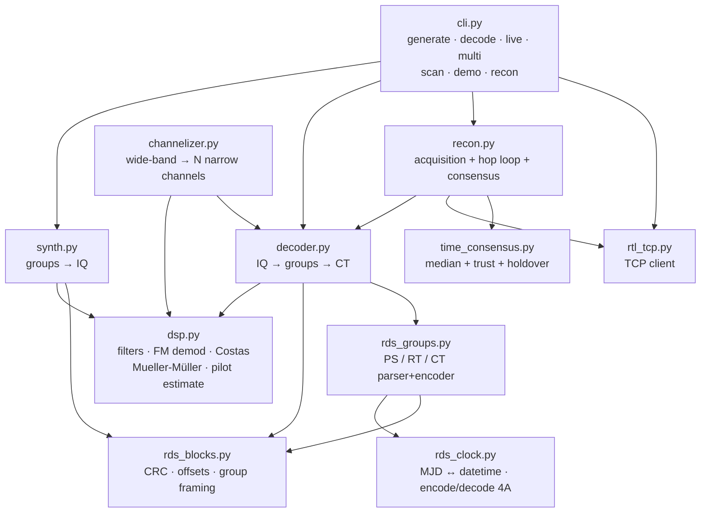
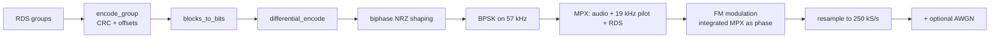

# Architecture

`rdsclock` is split into small, independently testable modules. Every
module is pure Python (NumPy + SciPy only) and side-effect free except
the obvious I/O entry points (`rtl_tcp.RtlTcpClient`, CLI helpers).

## Module Map

## Decoding Pipeline

The end-to-end pipeline `decode_iq(iq, fs)` runs the following stages,
each implemented in `dsp.py` and orchestrated by `decoder.py`:

1. **Channel filter** — FIR lowpass at ±100 kHz centred on the tuner.
2. **FM demodulation** — instantaneous-phase differentiation.
3. **Pilot-based carrier estimate** — locate the 19 kHz pilot (the
   `make_mpx` stereo reference) and multiply by 3 to get the RDS
   subcarrier centre. This is robust against typical RTL-SDR drift.
4. **Shift + filter** — bandpass around the located subcarrier, mix
   to DC, lowpass to ~4 kHz.
5. **Decimation** — drop to 19 kS/s (16 samples per symbol).
6. **Coarse frequency correction** — remove the residual offset
   via the phase-difference estimator.
7. **Symbol LPF** — zero-phase `filtfilt` at 4 kHz cut-off (falls
   back to `lfilter` for short streams).
8. **Costas loop** — second-order BPSK phase tracker.
9. **Clock recovery** — two parallel methods race:
   - best-symbol-offset (energy maximisation),
   - Mueller–Müller (closed-loop timing recovery).
   The method that yields more groups wins.
10. **Hard slice + differential decode** — recover data bits.
11. **Block hunt** — `find_groups_in_bitstream` slides over the
    bitstream looking for four consecutive valid blocks; enforces
    `C` vs `C'` offset based on the version bit in block B.
12. **Group parse** — `parse_groups` aggregates PS, RT and CT into
    a `StationInfo`.

## Synthesis Pipeline

`synth.py` is the inverse, used by the test suite to validate the
decoder end-to-end without an SDR:

## Multi-source Time Consensus

`time_consensus.TimeConsensus` keeps a per-station track
(`StationTrack`) keyed by `(rounded_freq, PI)`. For each consensus
call:

1. The active tracks (younger than `stale_age_s`) are listed.
2. Each track produces an "estimated UTC right now" using its last
   observation plus elapsed monotonic time.
3. The median epoch and the MAD (median absolute deviation) are
   computed.
4. Tracks whose estimate diverges by more than
   `OUTLIER_THRESHOLD_S` from the median are penalised
   (`consecutive_outliers` ↑, `trust_score` ↓); the rest accumulate
   trust.
5. The uncertainty is `max(MAD/2, drift_term, 1 s)` where the drift
   term grows linearly with the age of the median.
6. The trust level (HIGH / MEDIUM / LOW / STALE) is derived from
   the number of contributing sources and the median age.

## Recon Loop

`recon.run_recon` cycles through two phases:

- **Acquisition** when the watchlist is empty or `rescan_min`
  minutes have elapsed: `quick_scan_band` records short captures,
  attempts a decode, and ranks candidates by `(has_ct, n_groups,
  rssi_db)`. The top `max_watchlist` enter the watchlist.
- **Maintenance**: `hop_collect_ct` hops through the watchlist,
  recording `dwell_s` seconds per station and feeding decoded CT
  into the consensus engine. After every cycle the operator-facing
  status block is rendered (see `render_status`).

The offline variant `run_recon_offline` replays the same logic over
pre-recorded `.iq` files and is the primary integration test for the
consensus engine.

## File-format Conventions

- **`*.iq` (complex64)** — native format produced by `dsp.write_iq_complex64`
  and the RTL-SDR live capture path. Little-endian, 8 bytes per sample.
- **`*.iq` (uint8)** — interleaved I/Q in the `rtl_sdr` convention
  (bias 127.5, scale 127.5). Used for compatibility with external tools.
- `decoder.decode_file` autodetects the two formats by inspecting a
  prefix of the file.
