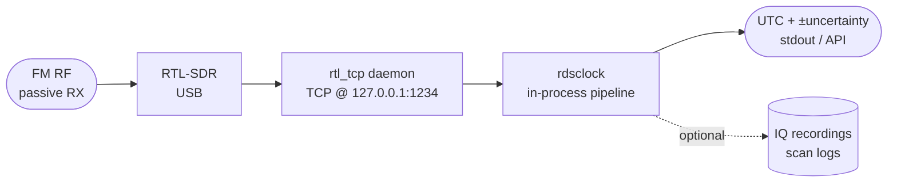

# Threat Model

This document describes the security and operational assumptions of
`rdsclock` and the threats the design intends to mitigate.

## Purpose

`rdsclock` provides a **passive, audit-friendly source of UTC time** for
environments where GPS or NTP are unavailable or untrustworthy. Typical
use cases:

- Time-keeping where a GPS signal is degraded or absent.
- Air-gapped systems that must not initiate outbound network traffic.
- Forensic time-stamping where a non-GPS reference is required to
  cross-check.

The product is **not** a substitute for accurate time-keeping in
safety-critical or hard-real-time systems. It targets ±1 minute
accuracy on a station with GPS-disciplined CT, ±seconds with
multi-source consensus across several such stations.

## System Boundary

The receiver:

- Reads IQ samples from a local `rtl_tcp` socket.
- Performs DSP, RDS decoding and time consensus entirely in-process.
- Optionally writes IQ recordings, scan logs and a structured
  consensus output.

The receiver does **not**:

- Open outbound network connections.
- Transmit any RF.
- Use the system clock as a source of truth (the system clock is
  only displayed alongside the consensus for comparison).

## Trust Boundaries

| Boundary                           | Assumption                                       |
|------------------------------------|--------------------------------------------------|
| USB / SDR firmware                 | Trusted; hardware-rooted.                        |
| `rtl_tcp` daemon (localhost)       | Trusted; same UID as the user running rdsclock.  |
| FM broadcast signal                | **Untrusted**; can be jammed, spoofed, or absent.|
| Recorded IQ files                  | Sensitive (capture metadata leaks operational data). |
| `consensus.summary()` output       | Sensitive (frequencies, PI codes, timing).       |

## Threat → Mitigation Matrix

| Threat                                              | Mitigation                                                                                                 |
|-----------------------------------------------------|------------------------------------------------------------------------------------------------------------|
| **T1.** Single station broadcasts incorrect CT.     | Multi-source median. A station diverging from the median by more than `OUTLIER_THRESHOLD_S` is penalised. |
| **T2.** Attacker forges RDS on a captured carrier.  | An RF fingerprint per station (CFO, RSSI, PI) is recorded for analysis; programmatic shift detection is planned for a future release. |
| **T3.** Attacker takes over multiple weak stations. | Trust accrues over time; new stations enter with neutral 0.5 trust and must converge with existing ones.  |
| **T4.** Attacker jams the FM band.                  | The receiver enters **holdover**: continues estimating UTC from the local oscillator and announces growing uncertainty until manual intervention. |
| **T5.** Tuner drift moves the RDS subcarrier.       | The pilot-based carrier estimator (`estimate_pilot_19khz × 3`) tracks the actual subcarrier even with ±10 ppm drift. |
| **T6.** Sample-timing drift across long captures.   | Two parallel clock-recovery paths (best-symbol-offset + Mueller–Müller). The one yielding more groups wins. |
| **T7.** Network attacker reaches `rtl_tcp`.         | The daemon binds to `127.0.0.1` by default; the documentation explicitly warns against `0.0.0.0`.         |
| **T8.** Operational metadata leaks via logs / IQ.   | `SECURITY.md` lists sensitive artefacts. The default install does not write any log to disk.              |
| **T9.** Stations stop broadcasting CT.              | Holdover with explicit uncertainty growth; consensus enters `STALE` once `mission_precision_s` is exceeded. |

## Out of Scope

- Defending against active local-area attackers with full physical
  access to the SDR or the host.
- Defending against an adversary that can co-opt the GPS-discipline
  upstream of every reachable FM transmitter simultaneously.
- Detecting subtle, sub-minute clock drift introduced by a slowly
  miscalibrated broadcast chain.

## Operational Controls

1. Run `rtl_tcp` on `127.0.0.1` only.
2. Treat IQ recordings as classified at the same level as the
   operational context that produced them.
3. Periodically refresh the trusted-station allowlist offline; do
   not bootstrap trust from a single scan in a hostile environment.
4. Cross-check the displayed consensus against any other available
   non-GPS time reference (hand-held watch, written log) at the start
   of operation.

## Reporting Issues

See [`SECURITY.md`](../SECURITY.md) for the disclosure process.
